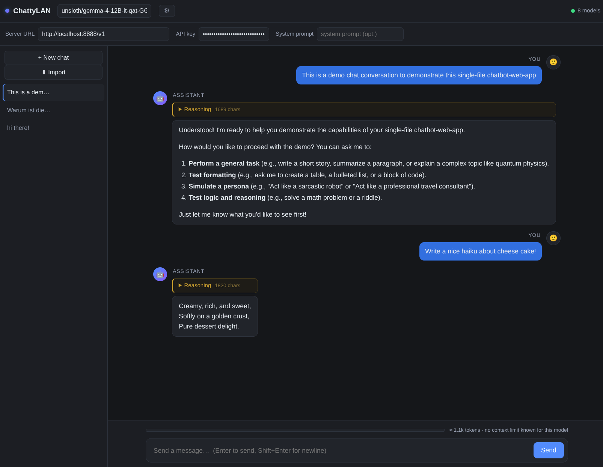

# ChattyLAN

> ⚠️ **Vibe-coded project** — this code was written by an AI assistant without
> formal review or testing. It works for its intended purpose, but use it with
> adequate care: don't paste sensitive data into it, and review the code before
> trusting it with anything important.

A minimal web UI for chatting with a local LLM server on your LAN.
Works with any **OpenAI-compatible** server: LM Studio, Unsloth Studio, llama.cpp `llama-server` (and friends like Ollama).

## Two ways to use it

| | **Mode 1 — single file** | **Mode 2 — login & multi-user** |
|---|---|---|
| What you run | just `index.html` | `docker compose up -d --build` (or plain `node server.js`) |
| Setup | none — open the file or serve it statically | one Docker container on your NAS |
| Users | 1 (your browser) | up to 10, each with username + password |
| Where history lives | your browser's `localStorage` | on the server, per user (`./data`) |
| Best for | personal use, quick testing | a shared NAS that several people use |

Both modes share the same UI and features; Mode 2 simply adds an account system
around it. The app detects automatically which mode it's in — no configuration needed.



## Features

- Enter the server URL (e.g. `http://192.168.1.50:1234/v1`) and go — model list is fetched from `/v1/models`
- Token streaming (SSE) with a Stop button
- **Reasoning** shown in a collapsible block (reads `reasoning_content`, fallback `reasoning`)
- **Persistent history**: multiple conversations saved in your browser's `localStorage` (new / switch / rename / delete — hover a chat for the icons)
- **Collapsible chat list**: the ☰ button in the header hides/shows the sidebar so the conversation gets the full width — on small screens (≤ 760px, e.g. smartphones) it starts hidden by default; your choice is remembered per browser
- **Save / load to file**: hover a chat in the sidebar — ⬇ downloads it as JSON (incl. reasoning, re-importable via ⬆ Import), `MD` exports it as Markdown (reasoning is omitted)
- **Regenerate / branch**: hover the last answer for ↻ regenerate (replaces it); hover one of your messages for ⑂ to branch off into a new chat with the history up to that point (ending at the previous complete answer — your message is not carried over)
- **Context usage bar**: shows estimated token usage of the current chat vs. the model's context length (read from `/v1/models`), turns yellow at 70% and red at 90%, with a warning near/over the limit
- Optional API key and system prompt, both persisted
- Minimal offline markdown rendering (code blocks, inline code, bold/italic, links)
- **Mode 2 only:** username + password login, per-user chat history stored on the
  server, up to 10 users by default (see below)
- **Admin user** (Mode 2): the `INITIAL_USER` account gets a 👥 *Users* button in the
  header that lists all registered users with their last login date/time

## Mode 1 — single file (no login)

Just open `index.html`. Any static file server works:

```sh
cd ChattyLAN
python3 -m http.server 8000
# → open http://localhost:8000
```

You can also just double-click `index.html` and open it directly — the servers allow
cross-origin requests by default, so `file://` works too. History lives in your
browser's `localStorage`.

## Mode 2 — login & multi-user (Docker / NAS)

The recommended way to share ChattyLAN with other people on your network.
One container, no dependencies, no build step beyond the image build:

```sh
cd ChattyLAN
cp .env.example .env   # optional — set DATA_KEY / INITIAL_USER etc. (gitignored)
docker compose up -d --build
# → open http://<nas-ip>:8080 and create your first account
```

On a **Synology** NAS: *Container Manager → Project → Add*, point it at this folder
(it picks up `docker-compose.yml` automatically). The image is plain `node:alpine`,
so any Docker-capable NAS works. Chat data persists in `./data` (a volume), so
upgrades and container rebuilds don't lose anything.

On first visit you create an account (or pre-create one via `INITIAL_USER` /
`INITIAL_PASSWORD` in `.env`); registration stays open until 10 accounts exist,
then closes automatically. Each user gets their own settings and chat history,
stored under `./data/users/`.

The `INITIAL_USER` account is the **admin**: it sees a 👥 *Users* button next to its
name in the header, which opens a list of all registered users with their last
login date/time. If the account already existed before this feature was added,
it is promoted to admin automatically on the next start.

<details>
<summary><b>No Docker?</b> Run the backend directly with Node.js (≥ 18)</summary>

```sh
cd ChattyLAN
node server.js            # → open http://localhost:80
```

Same behavior, same env vars — data goes to `./data` next to `server.js`.
</details>

When running via Docker, these are read from a `.env` file next to
`docker-compose.yml` — copy `.env.example` to `.env` and fill it in (`.env` is
gitignored, so secrets never end up in the repo). Useful environment variables:

| Variable | Default | Meaning |
|---|---|---|
| `PORT` / `HOST` | `80` / `0.0.0.0` | listen address |
| `DATA_DIR` | `./data` | where users/sessions/chat data are stored |
| `MAX_USERS` | `10` | registration cap |
| `SESSION_DAYS` | `7` | session idle timeout (sliding — any activity extends it) |
| `DATA_KEY` | off | if set, per-user chat data is encrypted at rest (AES-256-GCM) |
| `ALLOW_REGISTER` | on | set to `0` to disable self-registration |
| `INITIAL_USER` / `INITIAL_PASSWORD` | — | pre-create an account on first boot (password ≥ 8 chars); this account is the admin (👥 *Users* button) |
| `FORCE_SECURE` | off | set to `1` if TLS is terminated in front of the server |

Security notes: passwords are hashed with scrypt (per-user salt, constant-time
compare), sessions use random 256-bit tokens in `HttpOnly; SameSite=Lax` cookies,
and there's a per-IP lockout after 5 failed logins. Set `DATA_KEY` to encrypt chat
data at rest (AES-256-GCM); without it the per-user data files are plain JSON.
This is "simple yet secure" for a trusted LAN — it is not hardened against
internet exposure (put it behind TLS if you do that).

## Server notes

| Server | URL to enter | Notes |
|---|---|---|
| LM Studio | `http://<ip>:1234/v1` | Start the local server in LM Studio; CORS is open by default |
| llama.cpp | `http://<ip>:8080/v1` | Bind to LAN: `llama-server -m model.gguf --host 0.0.0.0`. Reasoning: default `--reasoning-format auto` usually populates `reasoning_content`; force it with `--reasoning-format deepseek`. Optional auth: `--api-key KEY` (enter the key in the UI) |
| Unsloth Studio | `http://<ip>:<port>/v1` | Enable its built-in server; same OpenAI-compatible API |

If a server ever blocks cross-origin requests, set it to allow your browser's origin
(e.g. llama.cpp: `--cors-origins http://localhost:8000`) or serve this UI from the
same machine.

## Data & privacy

- **Mode 2** (Docker / `server.js`): settings + chat history are stored per user
  under `DATA_DIR/users/<user>.json`. Nothing leaves your LAN except the chat
  requests themselves. Deleting a user's file wipes their data. Set `DATA_KEY`
  to encrypt these files at rest (AES-256-GCM); by default they are plain JSON.
- **Mode 1** (static hosting / `file://`): everything lives in your browser's
  `localStorage` under the keys `chatty.settings`, `chatty.chats`, `chatty.active`
  and `chatty.nav` (sidebar open/closed state).

Note: `localStorage` is per browser *and* per origin (`file://` vs `http://localhost:8000`
are different stores), and has a ~5–10 MB quota. If it fills up, the app shows a warning
bar — export chats to file (⬇ / MD) or delete old ones. File export/import has no size
limit, so that's also the way to keep very large conversations: export → free space in
the browser → re-import later via ⬆ Import.
